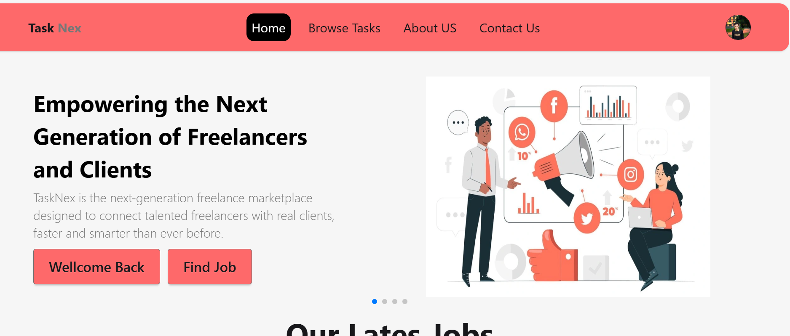

# 💼 TaskNex - Freelance Bidding Platform

A freelance bidding platform where clients post tasks and freelancers bid in real-time. Built with React, Firebase Auth, Express.js & MongoDB. Includes dark mode, task dashboard, and responsive UI.


🌐 **Live Site URL:** [https://tasknex-dcccf.web.app/](https://tasknex-dcccf.web.app/)

---
## Screenshot


---

## 🎯 Purpose
TaskNex is to provide a simple yet efficient freelance bidding platform where clients can post tasks or projects, and freelancers can compete by placing bids. This platform bridges the gap between service seekers and skilled individuals, enabling smooth project hiring and task management in real-time. It aims to create a beginner-friendly freelancing environment with intuitive design, authentication, and real-time interactivity.

---

## ✨ Key Features

- 🔐 **User Authentication**: Sign up and login functionality using Firebase Authentication.
- 📤 **Post a Task**: Clients can post tasks/projects with title, budget, category, and deadline.
- 💬 **Bid System**: Freelancers can place bids on tasks with real-time bid count updates.
- 🎨 **Dark/Light Mode**: Seamless UI theme switching with Tailwind CSS dark mode support.
- 📊 **My Posted Tasks Panel**: Logged-in users can view and manage all their posted jobs with bid counts.
- 📝 **Reviews Section**: Display reviews from previous clients/freelancers on the home page.
- 🔍 **Responsive UI**: Fully responsive across devices using Tailwind CSS utility-first design.

---


## 🛠️ Technologies & Packages Used

### 🔷 Frontend
- **React** – JavaScript library for building user interfaces
- **React Router DOM** – For client-side routing and navigation
- **Tailwind CSS** – Utility-first CSS framework with built-in dark mode support
- **React Toastify** – For elegant toast notifications
- **React Awesome Reveal** – Scroll-based animation effects
- **React Datepicker (with date-fns)** – For selecting dates in forms

### 🔶 Backend
- **Express.js** – Lightweight Node.js framework for creating APIs
- **MongoDB (with Mongoose)** – NoSQL database to manage tasks, users, and bids

### 🔐 Authentication & Hosting
- **Firebase Authentication** – Handles user sign-up, login, and auth state
- **Firebase Hosting** – Fast and secure hosting for frontend deployment


---

## 🛠️ Local Setup Instructions

Follow these steps to run the project locally on your machine:

### Prerequisites
- [Node.js](https://nodejs.org/en/download/) installed (v14 or above recommended)
- Git installed (optional but recommended)

### Steps

```bash
# 1️⃣ Clone the repository
git clone https://github.com/mdjosimuddin198/tasknex-freelance-platform-client.git
# 2️⃣ Navigate into the project directory
cd tasknex-freelance-platform-client

# 3️⃣ Install dependencies
npm install

# 4️⃣ Run the development server
npm start

```
---
## 🤝 Contributing

Feel free to fork, contribute, or give feedback!

If you'd like to contribute, please follow these steps:

1. Fork the repository

2. Create your feature branch:
```bash
git checkout -b feature/YourFeature

```
3. Commit your changes:
```bash
git commit -m 'Add some feature'
```
4.Push to the branch:
```bash
git push origin feature/YourFeature
```
5. Open a Pull Request
   
Thanks for helping improve the project! 🙌

